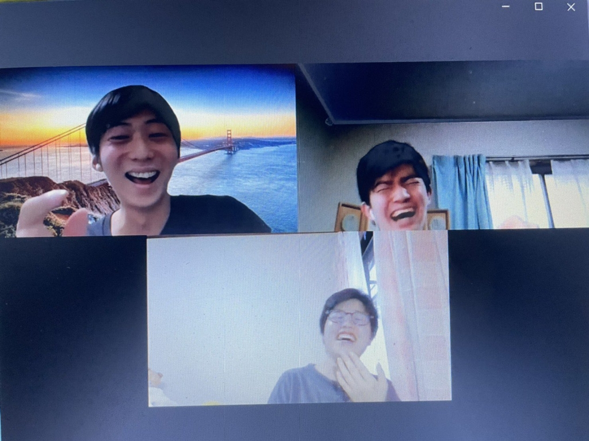

こーんにーちはーー！！
真弓でーーーす！

タイトルに何か特に深い意味は無いです。

コロナで皆気分が重くなっているとは思います。僕もそのうちの1人です…
ですが最近そうならないようにという意味合いも込めて、「この先の人生をより豊かにする7単語」というのを自分で定めてみました！

Positive(前向きな),Optimistic(楽観的な),Respect(尊敬する),Nice(素敵な),Honest(正直な),Unite(団結する),Believe(信じる)です。

これを心がけて生きるようになってからというもの、少し何か嫌なことがあっても受け止められるようになったり、雰囲気も変わったと言われるようになりました！
皆さんも自分でこういった「人生を豊かにする単語」というのを定めてみてはいかがですか？

さてこっからは演劇の話でも。
皆さん、泣く演技、笑う演技になった時って何か頭に思い浮かべますか？
よく聞く話だと、家族の不幸を思い出したり、レベルの高い人だとその役に入り込んで～なんて人もいるみたいですね。
僕が高校で演劇をやりたての頃、そういったハイレベルな技は出来ずに壁に当たっていました。
なので僕は思い出すだけで笑えるor泣ける動画というものを探して、それを思い出して涙を流したり、自然な笑いを作ろうしていた時期が昔ありました。
いいところまで言ったのでいうと、笑えるのだとクレヨンしんちゃんの野原家爆破の瞬間だとか、泣けるのだと安達祐実さん主演の「家なき子」のドラマ辺りがいいラインまで行きました。
そうして動画を探しているうちに、入り込んで演劇をしている先輩方やドラマの俳優だとかがいかに凄いのか身に染みてわかりましたね～。そんな困難を乗り越えて高校演劇の3年間を乗り切った思い出を、最近その頃の同期と喋った時に思い出しました！

果たして今回はどんな役者がどんなことを思い出しながら喜怒哀楽を表現するのか楽しみですね～！！

以上、自宅から真弓がお送りしましたー！！

写真無いのも寂しいんで、こないだ情報解禁の時に使った写真再掲しときますー
早く稽古場の写真載せれるようになって欲しいですね～
