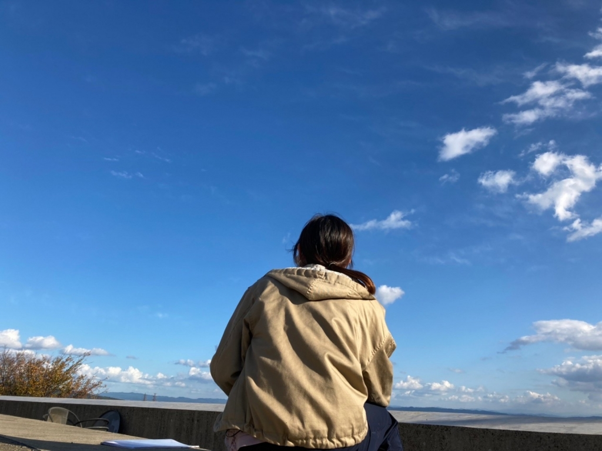

コロ助「今回の稽古はどうですか」

さつき「そうですね、やっぱり最後の公演ということもあって気合い入ってますね」

コロ助「まっ、台本も全員すでに覚えましたからね」

さつき「今回の卒公演は期間が短いこともあって流れが早いですからね、まぁセリフを覚えるのは役者として当たり前のことですよねぇ」

コロ助「あれ、さつきさん、今日セリフ失敗してましたよね？笑」

さつき「そんなそんな、お互い様じゃないですか笑」

コロ助「お互い、大切なセリフに限って失敗しましたからね」

さつき「最上回生かっこ悪っていうヤジが心に染みましたね…」

コロ助「同じく…」

さつき「これ、オチはどうするんですか」

コロ助「ないです」

さつき「…」

コロ助「…」

さつき「…」

コロ助「…」

さつき「はい、明日は3回生がブログをお送りいたします（知らんけど）」

コロ助「以上、コロ助とさつきがお送りしました！」
