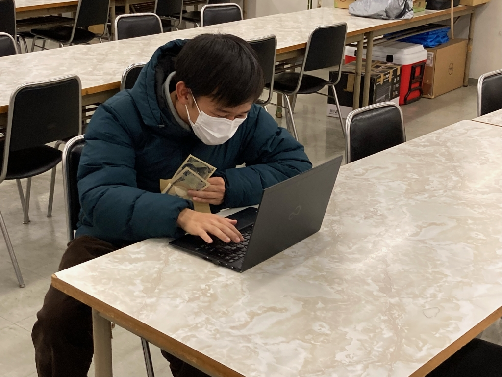

こーんにーちはーーーー！！！！
真弓です。

読みました？例の最終回！
詳しくは伏せますが、真逆のエンドを予想してた自分を殴りたくなるほどの終わり方でした！！

ハッピー道具、現実にもあったらな～なんて思います！具体的に言えば、仲直りリボンが2本程(勿論「本来」の使い方で)！もしくは思い出カメラでリボンが必要になる前に戻りたいな(勿論こっちも「本来」の使い方で…)…なんて思ったりする今日この頃です！！

URL貼っつけようかと思ったんですが、どーやらジャンプ+さんの禁止事項的にダメっぽいんで、気になる方はご自分でチェックだッピ！

さて、稽古に話を戻しましょ～～
新入生歓迎公演っつーことで、僕にとっては初めての役者経験となる公演になります！(色々あって過去2年出れなかったもので(--;))

4回生のこの時期ってことで、色々な方面から追い詰められてくるものはありますが、是非是非「スゲェ！このサークル入りてぇ！関わりてぇ！」って18の若造がなるような公演を打てたらなぁ～って気持ちで誠心誠意頑張っとりやす！((っていうかマジな話、人増えやな来年以降ヤバいですしおすし))

今回は、授業の空きコマとかでさくっと見れる長さの作品となってますので、演劇とかあんまりイメージ湧かんな～とか興味持ったことないな～って人でもお友達とでもかるーい気持ちで見に来てくれたら幸いですm(\_ \_)m
スタジオでやってます！4/13と14にやってます！感染対策もしてます！見に来てね！！！！！！！！！！！！！！！！！！！！！！！！！損はさせませんで！

P.S. m(\_ \_)mとか(^^;とか(--;)とか使うと今の演出感出ますね。

写真は、今月の総会費を全賭けして一世一代の大勝負に出る現会計(嘘)！
