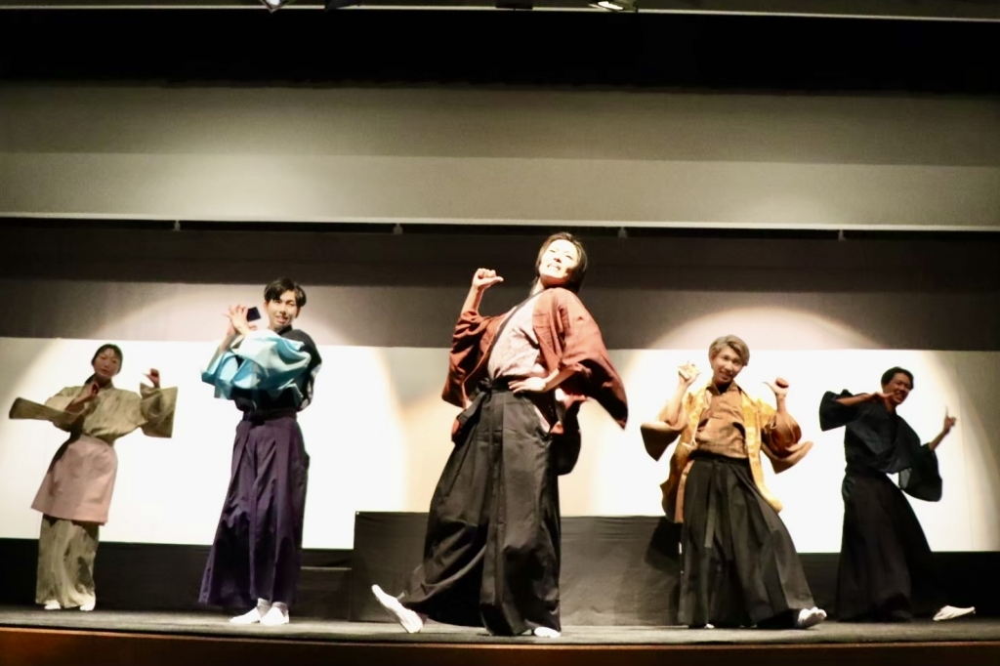

こんにちは！じょーかーです！！

まずは、新入生発表公演について。

公演終了のお知らせをしてなかったので、勝手に僕がしますねー

ーー公演終了のお知らせーーーーーーーーー

本公演(いや、前公演ですね)にて演出(制作チーフじゃないんかい)をさせていただいておりました1回生のじょーかーです。

おかげさまで関西大学劇団万絵巻2022年度新人発表公演『戦国SNS時代』が無事に公演終了いたしました。(1ヶ月以上前ですが…)

公演にご来場してくださったお客様、誠にありがとうございます。

劇団員を代表し、心よりお礼申し上げます。

新入生含め、劇団員一同、まだまだ未熟ではありますが、これからも皆様に楽しんでいただけるよう劇団員一同精進していきますので、またご来場ください。

ーーーーーーーーーーーーーーーーーーーー

これでやっと新発終わりました！

お疲れ様、自分。

楽しかったねー、みんなありがとう！

そして何よりご来場頂いたお客様、本当にありがとうございました！

新入生が主体となって行う公演だったので、未熟な点も多かったとは思いますが、これから成長して参りますので、是非色んな公演を観に来てください！！

では、ここからは新歓です。

さて、もう春になりましたね、キャンパスも桜が咲いていて、入学してもう1年経ったのかと思うばかりです。

まだ大学生の自覚ないんですけどね

そういえば、僕は明日成人になるみたいです…

……え？自分が成人？いやいや無いでしょ、この間まで小学生だったじゃん、仮面ライダーのベルト買ってもらって喜んでたじゃん…！

あと2時間ないじゃん！

なんていうか、ありきたりですけども、月日が経つのは早いもんなんですねー

久しぶりに稽古を見に行ったらもう桜も咲いてましたもん。

あ、今度桜の写真撮りにいかなきゃ！もう咲いてますもんね、急がなきゃ…

特にオチもないんですが、ブログはこんなところで。いや稽古場行ってないので、かけることなかったんです、許してください。

もし新入生の人が読んでたら意味わかんないですよね、すみません。

このサークルめっちゃ楽しいんで是非入ってね！一年上の先輩からのアドバイスだよ！

あと、新入生歓迎公演をするので、是非観にきてね！自分は照明の操作とかをします！

以上、じょーかーでした！

それではまた～
