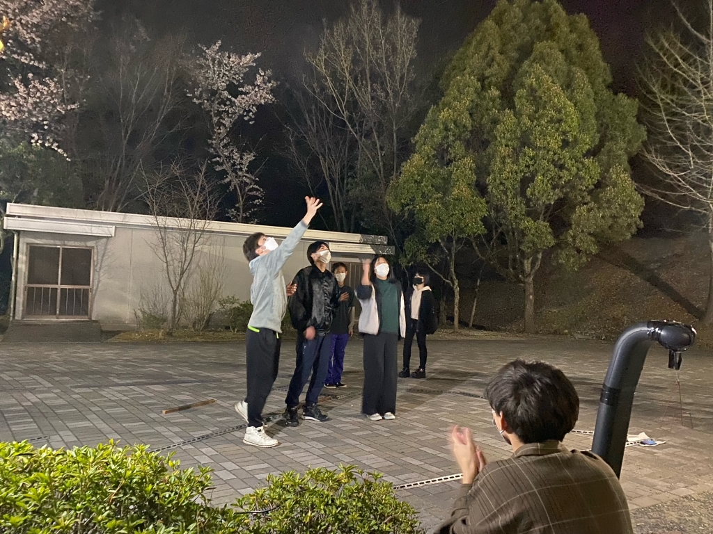

初めましてぽん酢です！今回の新歓で音響チーフをやらせていただいています。

先日のスタジオ通しでは、自分の心臓の音が周りに聞こえているんじゃないかってくらいバクバクでした。裏方でこれほどのプレッシャーなのに、役者の方々は本当にすごい、、、

色々な人に助けてもらってばかりですが、ミキサーなどを触るのはすごく楽しいし自分でも驚くほどやりがいを感じています。

本番も程よく気楽に頑張ります！

話は変わりますが、今学期は久しぶりにバスの定期を買いました。立地が悪い高槻キャンパスですが、バスに揺られる時間が好きなのでそこは気に入っています。

あと定期があると大学に行くモチベも上がりますね！また全面オンライン授業になるのだけは勘弁してください。

ではでは。

(……ブログって難しい！改行とかどこですればいいんじゃ)
