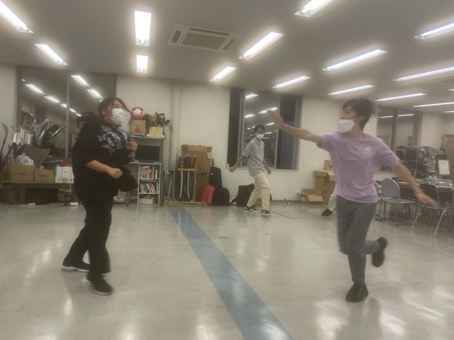

暑さ去りやらぬ、かと思いきや夜風に秋を感じる頃となりました。最近では鈴虫の声がいっそ煩く感じる程で、役者達も負けじと発声に勤しんでおります。

　さて挨拶も程々に自己紹介をば、近頃は生活習慣が崩れ始め四肢が気怠るい4回生、ナダルです。

　この秋、自分も役者をやる事とあいなって山奥の稽古場に毎日足を運ぶ羽目になりました。いえ、自業自得なので『羽目』というのは少し違うかもしれませんが兎も角、役者というのはひたすらに体力を消耗するもので、夏から引き続きハードな日々を過ごしています。

　しかし、自分が体力を消費したのはそれだけではありません。今までそれ程万絵巻以外にはアピールしてこなかったのですが何と私は4回生にして初の外部で出演を果たす事となったのです。

　ことの起こりは6月の初め辺りだったでしょうか、縁あってとある劇団に所属されている方と知り合う事となり外部のお誘いを受ける運びとなりました。私自身万絵巻以外で舞台に上がる気など更々無かった物ですから、何度も何度も何度も何度もお断りさせて頂いたのですが、是非にとお誘いを受けること数回、結局私の抵抗虚しく参加する事になりました。

　さて、どうせ出演するならばと私も気合を入れて三監の許可を得るために連絡しました。まずは口頭で。しかし、鼻で笑われるとは思いもしませんでした。私が外部に出る事が余程可笑しかったのでしょう。いえ、我ながら滑稽極まりないという事は重々承知であり、座長もその事を先刻承知であるからこその対応だったのでしょう。長年の信頼関係がなせる技とでも言いましょうかそうしましょうそうに決まっているのです。

　めでたく外部出演の許可を取り付けた私は、早速万絵巻内部で宣伝する事に致しました。いえ、本当は外部出演するという事自体は宣伝したかったですが、舞台そのものを見られたいかといえばそうとも言い切れず。しかし、全然誰も興味を示してくれなければそれはそれで寂しいというか何というかはい。面倒臭い野郎と嘲って下さい。

　とまれ、外部に出る事は周りに言いつつ日程だけは最後まで黙っていようと決めたのでした。しかし、外部の日程を黙っていたところで意味がないと気がついたのもすぐの事で、『そもそも、外部出る日は秋の稽古休むくね？』というヨネの一言で全てが台無しになってしまいました。それりゃあそうだ当然のことすぎで失念していた自分が呪わしい。とはいえ、その後結局後輩の一人が普通に探して当ててきて若干引いたのは別の話でしょうか。

　まぁ、結果を言えば私の外部を観に来る万は誰一人としていなかったとは言っておきましょうか。

ここまで、長々と書いたわけですが。

そろそろ飽きてきたので言うと私が出演した、外部というのは

**『M-1グランプリ』**

の事だったのです。ええ、漫才頂上決戦のあれです。

吉本興行の方と知り合う機会があり大学のゼミの教授とコンビを組んで出る羽目になりました。

まぁ、タイトルで分かってたとは思いますが。

さて、気になる結果ですが………

どうか自分の目で確かめて下さい！！！

あ、秋公演は【白騎士】って役ででます。よしなに

写真はs棟で鬼ごっこする真弓です。
