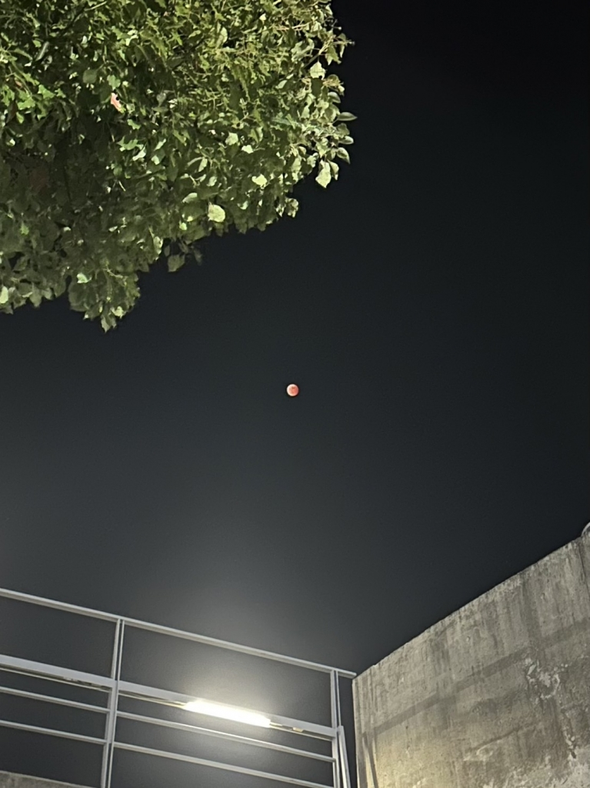

どうも〜にしきです。

秋公演ではダメな父親を演じてました〜、初めての大舞台チョー緊張してお見苦しいところもあったと思います、皆さんに満足いただける演技を目指して日々努力中です‼︎

さて、昨日(2022年11月8日)は太陽と月と地球、そして天王星が真っ直ぐ並ぶというトテモトテモ稀有な日でもありました。いろんな場所で皆既月食を迎えた赤い月が見えた事でしょう。赤い月はワンピースの映画を思い出しますね〜(オニ、ギリッ‼︎)

まぁそんな日に寒〜い関西大学高槻キャンパスで稽古していたわけですけど。

今回の卒公演はアンサンブルとして出させて頂きます！上回生の演技を間近で観て学ぶ毎日、残り1ヶ月ですが元気に稽古しております。ただ一つ問題点が...アンサンが全く集まらないっ‼︎ 同様に参加回数が低い僕も人のこと言えないんですけど、稽古中にガヤをしないといけないのに人が全然いなくて舞台がスカスカ...なんてのは日常茶飯事、アンサンみんなで練習したいなぁ

