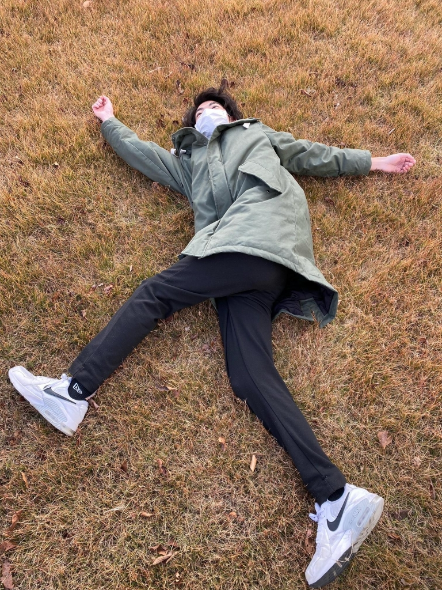

ふう。シーン作るかあ。声出したいし噴水の近くでやるかあ～

ん？

(うしみつがバス停に向かって歩いてくる)

おい！うしみつ！あれを見ろ!!!なんか〇んでるぞ！

(浅葱とうしみつが近付いてみる)

おいちくわなにやっとるんや。ポーズ取るなって。

どうも浅葱です。先輩方が卒業し、新発のシーズンが始まりました。今回は超絶久しぶりに役者やります。いつぶりくらいだろう？発声とか演技とか久々すぎてブランクが半端ないっす。でもオペとか演補とかやらで稽古場には行ってたので懐かしい感じはあんましないんですよね。ん？ああ、上のやつは噴水近くの草原でちくわが倒れていて変なポーズ取っていただけっていう話です。意味分かんねえ。

そう、最近ちくわの挙動がだんだん理解出来なくなりました。稽古場でC言語の教科書読んで勉強しているのはまだ理解できる。ただいきなり筋トレ始めたりタウンワーク読み始めるのは理解できん。しかもいきなり過去の公演の時のセリフ言い出したりもするので余計脳内バグります。訳分かんねえよ。

さて、新発までに狂気にさらされすぎて浅葱自身がバグってなかったらまたお会いしましょう。役者頑張ります。公演是非見に来て下さい。では。
